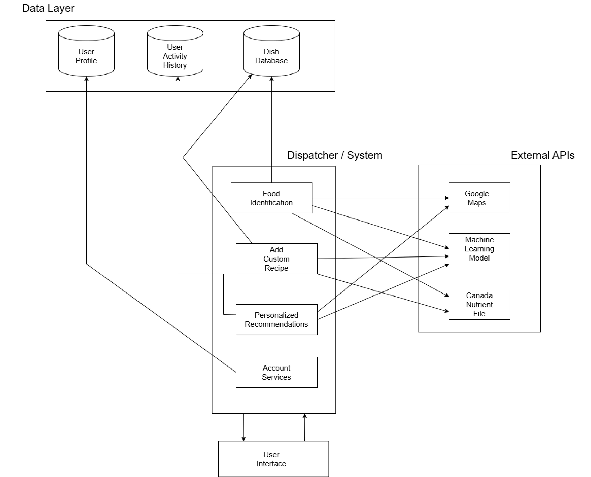
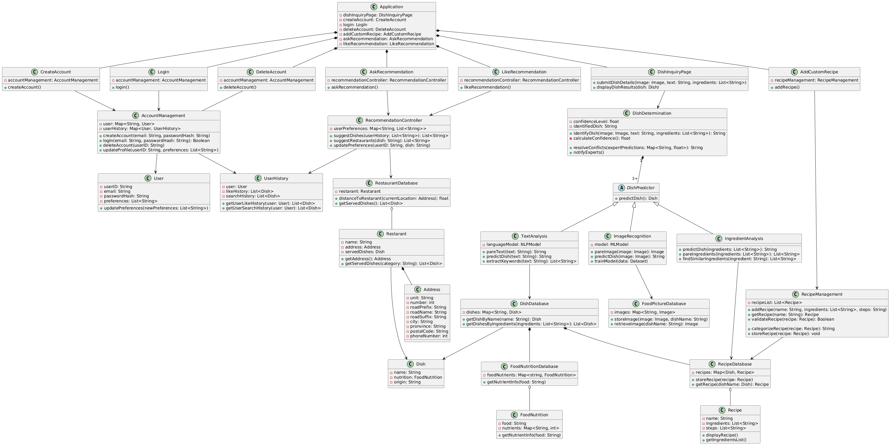

# 🍕 What’s That Dish

What’s That Dish? is a mobile app for identifying and learning about any dish you see — whether it’s in real life, a screenshot from Instagram, or a post on Facebook. Like Google Lens or Yuka, it lets you scan food for quick details, but it goes further by offering multiple ways to identify a dish: take a photo, type a short description, or list the ingredients.

Once a dish is identified, the app shows cultural background, recipes, and even nearby restaurants that serve it, using the Google Maps API. It also connects to trusted data sources like the Canada Nutrient File for accurate nutrition info.

In addition to recognition, users can add their own recipes and get personalized dish recommendations based on their likes and past searches. This combination of AI-powered recognition, community-driven recipes, and tailored suggestions makes food discovery simple, fun, and uniquely personal. 

---

## Overview
Identify dishes from photos, text, or ingredients, then get cultural details, recipes, and recommendations.  

---

## ✅ MVP Features
| ID   | Feature           | Description                   | Done |
|------|-------------------|-------------------------------|------|
| F01  | Image Input       | Upload food photo              | ✅   |
| F02  | Text Input        | Describe the dish              | ✅   |
| F03  | Ingredient Input  | List ingredients               | ✅   |
| F04  | Dish Info         | Show origin and culture        | ✅   |
| F05  | User Auth         | Sign up, log in, log out       | ✅   |
| F06  | Recipe Viewing    | See recipes with steps         | ✅   |
| F07  | Like a Dish       | Save favorite dishes           | ✅   |
| F08  | Recommendations   | Suggest dishes you might like  | ✅   |
| F09  | Navigation & UI   | Simple, clean interface        | ✅   |

---

## AI Features
| ID   | Feature            | Description                                    | Done |
|------|--------------------|------------------------------------------------|------|
| F12  | Multi-Expert Logic | Decision-making with conflict resolution (AI)  | ✅   |
| F14  | Recipe Categorize  | Auto-tag and filter recipes                     | ✅   |
| F13  | History Tracking   | Log activity for better suggestions            | ✅   |

---

## Extra Features *(if time allows)*
| ID   | Feature                 | Description                      | Done |
|------|-------------------------|----------------------------------|------|
| F10  | Custom Recipe           | Add your own recipes             | ✅   |
| F11  | Restaurant Suggestions  | Show places serving the dish     | ✅   |
| F15  | Profile Management      | Edit name, preferences, picture  | ✅   |

---
## UML Diagram
